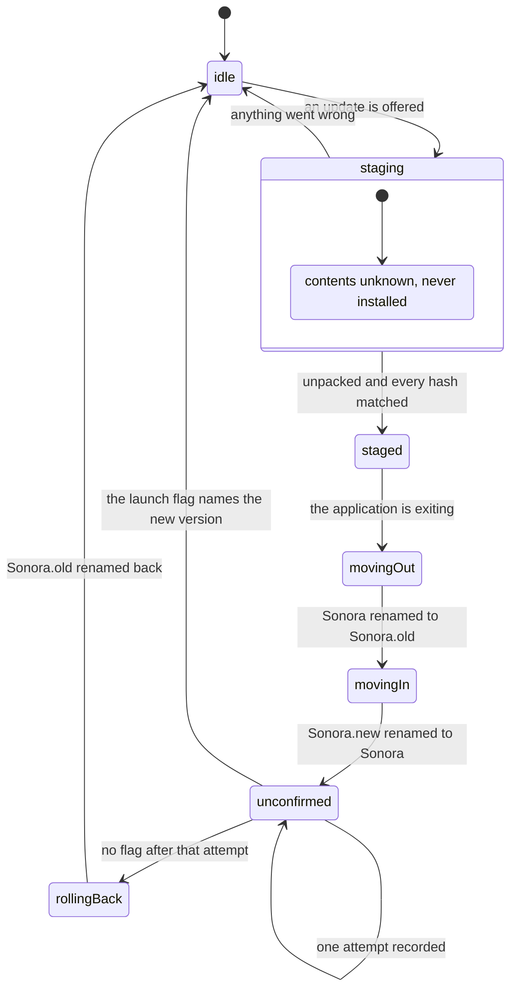

# The updater's states

This is the picture of [ADR 0011](adr/0011-the-swap-is-not-atomic-so-it-is-a-journal.md),
and it is here for one reader: whoever is looking at a machine where Sonora will not
start, at a journal file that says `moving-out`, wondering what is supposed to happen
next.

The four directories, all siblings under `%LOCALAPPDATA%\Programs`:

```
Sonora/            the installation -- exactly the archive's members and nothing else
Sonora.new/        the staged tree: unpacked, hashed, complete
Sonora.old/        the previous tree, kept until the new one has started
Sonora.update/     journal, launch flag, and the download in progress
```

`Sonora.update/` is outside every tree on purpose. The installation has to contain exactly
the members of the package it came from, or the client can never rebuild that package to
patch from — so a journal or a launch flag inside it would break the delta path silently,
in a way that costs 47 MiB per update and shows up nowhere.

## The stages



Two arrows are the whole design.

`staging → idle` is why a stage of its own exists. A tree that was being written when the
machine stopped is missing a file and nothing can tell which one, so it is deleted rather
than inspected. The download is lost; nothing else is.

`unconfirmed → unconfirmed` is the one attempt. The new version is installed, the old one
is still there, and the journal records that a chance has been given — so a version that
crashes before it can write the flag is noticed by the *next* start rather than by a
timer. There is no timer anywhere in this.

## What happens if the machine stops

Every step is written to the journal before it is performed, so the journal always
describes either what has happened or what was about to. Recovery is `NextStep(journal,
facts)`: it looks at the three directories, decides what one thing to do, and is called
again. Two examples, both real:

| The journal says | The disk shows | What happens |
|---|---|---|
| `moving-out` | `Sonora` still there | the rename is retried; it had not happened |
| `moving-out` | `Sonora.old`, no `Sonora` | the rename *had* happened; carry on to `moving-in` |
| `moving-in` | `Sonora.new`, no `Sonora` | retry |
| `idle` | `Sonora.old`, no `Sonora` | **put it back** — see below |
| anything | a journal this version cannot read | nothing at all |

The fourth row is the one the tests found rather than the design. An idle journal beside a
previous tree and no installation is exactly what a rollback that completed its rename and
lost power before its journal write leaves behind — the journal it was about to write is
the one already on the disk. The first version of `NextStep` swept the previous tree away
as rubbish, which would have deleted the only working copy of Sonora on the machine. It is
now the one case in the idle branch that does something.

The last row is a policy and not an omission: when the record of what is in flight cannot
be read, leaving the installation alone is the only safe answer, because what it might be
describing is a half-finished swap.

## Recovering by hand

Nothing here needs a tool. If an installation is stuck:

1. Look at `Sonora.update\journal`. It is JSON with two-space indentation, and the `stage`
   field is one of the words above.
2. If `Sonora\` exists, the application should start. Delete `Sonora.update\journal` and it
   will, with no update in flight.
3. If `Sonora\` does not exist and `Sonora.old\` does, rename `Sonora.old` to `Sonora`.
4. If neither exists, reinstall from the MSI. That is a supported recovery and it is why
   the installer still exists — see the second consequence in ADR 0011.

## Who runs what

```
Sonora.exe   at startup     RecoverBeforeStartup()   never moves anything
                            -> starts sonora-updater --apply and exits, if a move is due
             90 s in,        sonora-updater --check   a separate process, exits
             then every 6 h
             UI loaded      ConfirmLaunch()          writes the launch flag
             at exit        sonora-updater --apply   with --wait on its own process id

sonora-updater --apply      copies itself to %TEMP% and re-executes there first,
                            because Windows will not let a process delete the tree it
                            was loaded from
```
